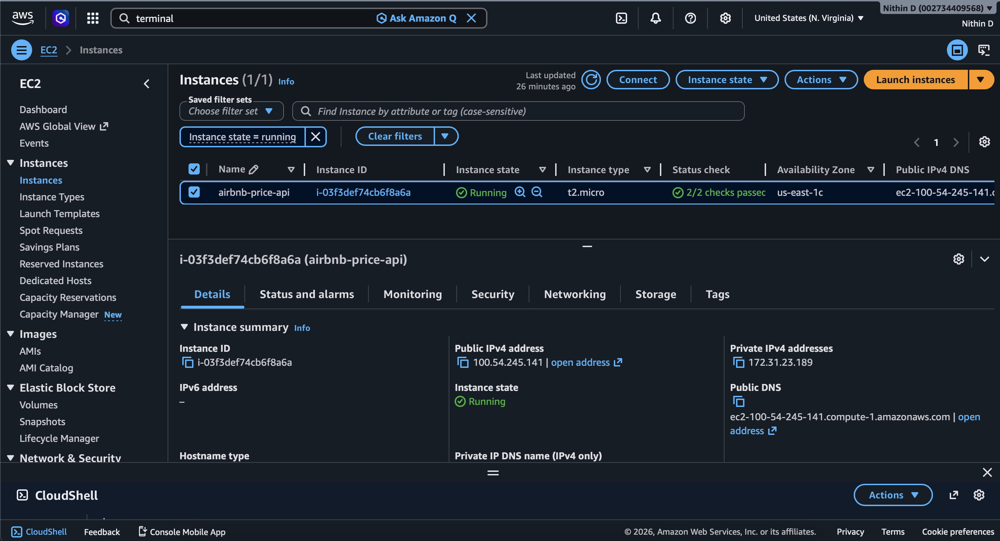
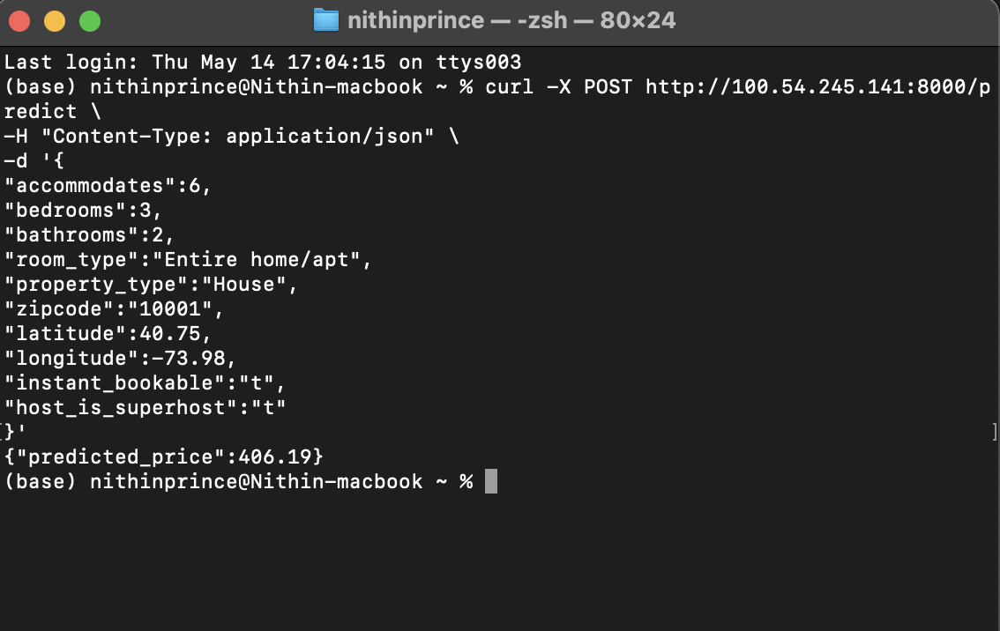
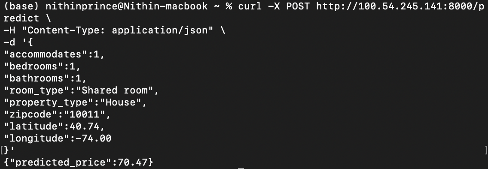
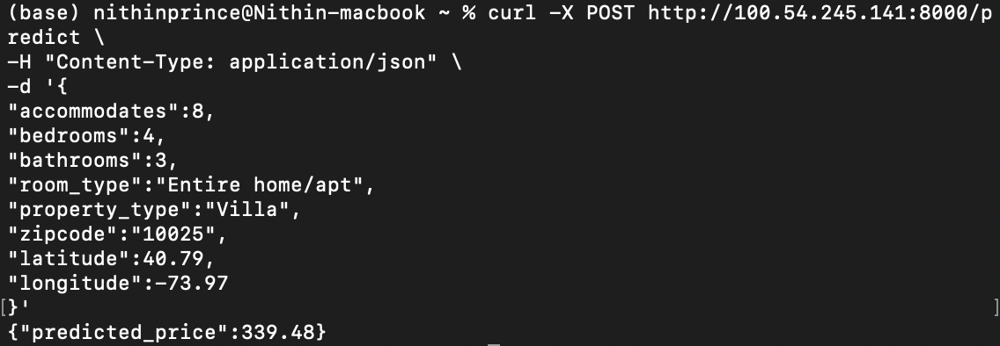

# 🏡 Airbnb Price Prediction API

A machine learning powered web application that predicts Airbnb listing prices based on property details, host information, and location-based features. This project demonstrates the complete end to end machine learning workflow  from data preprocessing and feature engineering to model deployment on AWS using Flask and Gunicorn.

---

## 🚀 Project Highlights

- Built a complete machine learning pipeline for Airbnb price prediction
- Engineered high impact features from real world listing data
- Developed a production ready Flask REST API for realtime predictions
- Deployed the application on AWS EC2 using Gunicorn
- Structured the project using clean ML engineering practices

---

## 📊 Dataset Overview

The dataset contains Airbnb listing information including:

- Property details
  - bedrooms
  - bathrooms
  - accommodates
  - room type
  - property type

- Location-based features
  - latitude
  - longitude
  - zipcode

- Host-related attributes
  - superhost status
  - instant booking availability
  - review information

The target variable is the nightly Airbnb listing price.

---

## ⚙️ Machine Learning Pipeline

### Data Preprocessing
- Handled missing values
- Removed invalid price entries
- Cleaned zipcode and percentage based columns
- Converted timestamps into numerical features
- Applied one-hot and multi-hot encoding

### Feature Engineering
- Host activity features
- Availability based features
- Review related features
- Location and accommodation features

### Models Experimented
- Ridge Regression
- XGBoost
- HistGradientBoosting
- LightGBM ✅ (Final Model)

### Final Model Selection
LightGBM was selected as the final model because it provided the best performance on the RMSLE evaluation metric while handling high-dimensional tabular data efficiently.

---

## 📈 Evaluation Metric

The project uses:

```text
RMSLE (Root Mean Squared Log Error)
```

This metric is suitable for price prediction problems because it penalizes large relative prediction errors while reducing the impact of extreme outliers.

---

## 🌐 Deployment Architecture

```text
User Request
     ↓
Flask REST API
     ↓
Feature Engineering Pipeline
     ↓
LightGBM Prediction Model
     ↓
JSON Response
```

---

## ☁️ Cloud Deployment

The application was deployed on AWS EC2 using:

- Flask
- Gunicorn
- Ubuntu EC2 instance
- Security group configuration
- Public API hosting

Live API Endpoint:

```text
http://100.54.245.141:8000/
```

---

## 📦 API Example

### Prediction Request

```bash
curl -X POST http://100.54.245.141:8000/predict \
-H "Content-Type: application/json" \
-d '{
"accommodates":4,
"bedrooms":2,
"bathrooms":1.5,
"room_type":"Entire home/apt",
"property_type":"Apartment",
"zipcode":"10003",
"latitude":40.73,
"longitude":-73.99
}'
```

### Sample Response

```json
{
  "predicted_price": 182.02
}
```

---

## 📸 Project Screenshots

### AWS EC2 Deployment


---

### Live API Running


---

### Prediction Response 1


---

### Prediction Response 2


---

### Prediction Response 3


---

## 🛠️ Technologies Used

### Programming & ML
- Python
- Pandas
- NumPy
- Scikit-learn
- LightGBM
- XGBoost

### Backend & Deployment
- Flask
- Gunicorn
- AWS EC2
- Linux (Ubuntu)

### Development Tools
- Jupyter Notebook
- Git
- GitHub

---

## 📁 Project Structure

```text
airbnb-price-api/
├── app.py
├── predict_utils.py
├── requirements.txt
├── models/
├── notebooks/
├── reports/
├── screenshots/
└── README.md
```

---

## 🔥 Key Learnings

- Building scalable ML inference APIs
- Managing feature consistency between training and inference
- Cloud deployment using AWS EC2
- Production model serving with Gunicorn
- Structuring real-world ML engineering projects

---

## 🔮 Future Improvements

- Add geospatial clustering features
- Hyperparameter tuning with cross-validation
- Build a frontend interface for user interaction
- Dockerize the application
- Add CI/CD pipeline for automated deployment

---

## 👨‍💻 Author

**Nithin Datta Desu**  
MS in Data Science  
Machine Learning | Data Science | Cloud Deployment